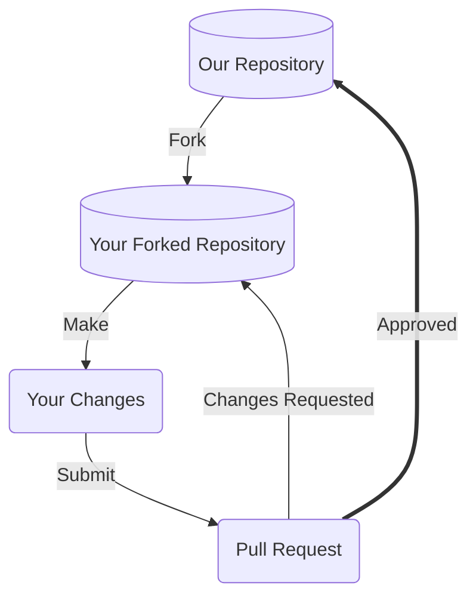

# Contributing to KASSTA Web

Thanks for taking the time to consider contributing! We very much appreciate your time and effort. This document outlines the many ways you can contribute to our project, and provides detailed guidance on best practices. We look forward to your help!

## Prerequisites

Before you begin contributing to our project, it'll be a good idea to ensure you've satisfied the below pre-requisites.

### License

Our project has our licensing terms, including rules governing redistribution, documented in our [LICENSE](LICENSE) file. Please take a look at that file and ensure you understand the terms. This will impact how we, or others, use your contributions.

### Developer Environment

At a minimum, to submit patches you'll want to ensure you have:
1. An account on GitHub.
2. Git installed on your local machine.
3. Node.js (for running the development server).
4. The ability to edit, build, and test the project on your local machine. See our [README.md](README.md) for setup details.

### Communication Channels

Before contributing changes to our project, it's a great idea to be familiar with our communication channels and to socialize your potential contributions to get feedback early.

Our communication channels are:
- [Issue tracker](https://github.com/kassta/kassta_web/issues) - a regularly monitored area to report issues with our software or propose changes
- [Pull requests](https://github.com/kassta/kassta_web/pulls) - submit and review proposed changes

## Our Development Process

Our project integrates contributions from many people, and so we'd like to outline a process you can use to visualize how your contributions may be integrated if you provide something.



### Fork our Repository

Forking our repository, as opposed to directly committing to a branch, is the preferred way to propose changes.

See [this GitHub guide](https://docs.github.com/en/get-started/quickstart/fork-a-repo) on forking for information specific to GitHub.com.

#### Find or File an Issue

Make sure people are aware you're working on a patch! Check out our [issue tracker](https://github.com/kassta/kassta_web/issues) and find an open issue you'd like to work against, or alternatively file a new issue and mention you're working on a patch.

#### Choose the Right Branch to Fork

Our project typically has the following branches available:
- `main` - default branch

### Make your Modifications

Within your local development environment, this is the stage at which you'll propose your changes, and commit those changes back to version control. See the [README.md](README.md) for more specifics on setting up your local development environment.

#### Commit Messages

Commit messages to version control should reference a ticket in their title / summary line:

```
Issue #248 - Show an example commit message title
```

This makes sure that tickets are updated on GitHub with references to commits that are related to them.

Commits should always be atomic. Keep solutions isolated whenever possible. Filler commits such as "clean up white space" or "fix typo" should be merged together before making a pull request.

### Submit a Pull Request

Pull requests are the core way our project will receive your patch contributions. Navigate to your branch on your own fork within GitHub, and submit a pull request.

Please make sure to provide a meaningful text description to your pull requests.

**Working on your first Pull Request?** See guide: [How to Contribute to an Open Source Project on GitHub](https://kcd.im/pull-request)

### Reviewing your Pull Request

Reviewing pull-requests, or any kinds of proposed patch changes, is an art. That being said, we follow the following best practices:
- **Intent** - is the purpose of your pull-request clearly stated?
- **Solution** - is your pull-request doing what you want it to?
- **Correctness** - is your pull-request doing what you want it to *correctly*?
- **Small Patches** - is your patch of a level of complexity and brevity that it can actually be reviewed by a human being?
- **Coding best practices** - are you following best practices in the coding language being used?
- **Readability** - is your patch readable, and ultimately maintainable, by others?
- **Tests** - do you have or have conducted meaningful tests?

## Ways to Contribute

### Issue Tickets

Issue tickets are a very simple way to get involved in our project. It also helps new contributors get an understanding of the project more comprehensively.

See our list of issues at: [GitHub Issues](https://github.com/kassta/kassta_web/issues)

#### Submitting Bug Issues

Resolving bugs is a priority for our project. We welcome bug reports. Please make sure to do the following prior to submitting a bug report:
- **Check for duplicates** - there may be a bug report already describing your issue.

Here's some guidance on submitting a bug issue:
1. Navigate to our [issue tracker](https://github.com/kassta/kassta_web/issues) and file a new issue
2. Include a code snippet if you have it showcasing the bug
3. Provide reproducible steps of how to recreate the bug
4. If the bug triggers an exception or error message, include the *full message* or *stacktrace*
5. Provide information about your operating system and browser version

#### Submitting New Feature Issues

We welcome new feature requests to help grow our project. Please make sure to do the following prior to submitting a new feature request:
- **Check for duplicates** - there may be a new feature issue already describing your request
- **Consider alternatives** - is your feature really needed? Or is there a feature within our project that may help you achieve what you want?

### Code

It's **highly** advised that you take a look at our [issue tracker](https://github.com/kassta/kassta_web/issues) before considering any code contributions. Here's some guidelines:
1. Check if any duplicate issues exist that cover your code contribution idea / task, and add comments to those tickets with your thoughts.
2. If no duplicates exist, create a new issue ticket and get a conversation started before making code changes.

Once you have a solid issue ticket in hand and are ready to work on code:
1. Ensure you have development [prerequisites](#prerequisites) cleared.
2. Have your [developer environment](#developer-environment) set up properly.
3. Go through our [development process](#our-development-process), including proposing changes to our project.

### Documentation

Documentation is the core way our users and contributors learn about the project. We place a high value on the quality, thoroughness, and readability of our documentation. Writing or editing documentation is an excellent way to contribute to our project without performing active coding.

## Acknowledgements

This contributing guide was adapted from the [SLIM](https://github.com/NASA-AMMOS/slim) project templates. We thank those projects for setting the foundation upon which this guide was built.
